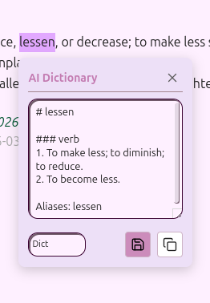

Here is the complete, professional **README.md** in English, optimized for GitHub with clear navigation and callouts.

-----

# 🌐 Obsidian AI Translator

**A sophisticated AI-powered translation and personal dictionary system for Obsidian, powered by TaGiaHuy and community APIs.**

-----

## ✨ Features

### 🌍 Multiple Translation Engines

  - **AI-Powered Intelligence**: Deep integration with **Google Gemini**, **OpenAI**, and **OpenRouter** for context-aware translations.
  - **High-Speed Lookups**: Built-in support for **Google Translate API** (browser-based) and **Free Dictionary API** for instant results without needing API keys.

### 🔍 Interactive Dictionary Popup

  - **Fully Draggable**: Position the popup anywhere on your screen; it stays where you want it.
  - **On-the-fly Switching**: Compare translations instantly by switching providers via a dropdown menu inside the popup.
  - **Live Editing**: Refine or add personal notes to the AI-generated definition before saving it to your vault.
  - **Smart Actions**: Save definitions using custom templates or copy results to your clipboard with a single click.

### ⚡ Seamless Workflow

  - **Auto-Trigger Mode**: Automatically trigger the popup upon text selection for a friction-less reading experience.
  - **Provider Loop**: Cycle through your favorite AI engines instantly using a customizable hotkey.
  - **Inline Translation**: Replace selected text with its translation directly in the editor (e.g., `Hello` ➔ `Hello (Xin chào)`).

-----

## 🔌 Recommended Integrations

While **AI Translator** is a standalone plugin, it is designed to work in synergy with the following tools to supercharge your learning:

1.  **[Note Definitions](https://www.google.com/search?q=https://github.com/mProjectsCode/obsidian-note-definitions)**: Display your saved definitions as tooltips when hovering over words in other notes, eliminating the need to re-translate.
2.  **[Spaced Repetition](https://www.google.com/search?q=https://github.com/stravid/obsidian-spaced-repetition)**: Automatically turn your saved vocabulary into flashcards for long-term retention.

> [\!IMPORTANT]
> **Note:** These are independent projects. You must install them separately from the Community Plugins store to enable these integrated workflows.

-----

## 🚀 Installation

### Option 1: Community Plugins (Coming Soon)

1.  Go to **Settings** \> **Community plugins**.
2.  Click **Browse** and search for `AI Translator`.
3.  Click **Install**, then **Enable**.

### Option 2: Manual Installation

1.  Download the latest release (`main.js`, `styles.css`, `manifest.json`) from the Releases page.
2.  Create a folder named `obsidian-ai-translator` in: `<your-vault>/.obsidian/plugins/`.
3.  Move the downloaded files into that folder.
4.  Reload Obsidian and enable the plugin in **Settings** \> **Community plugins**.

-----

## ⚙️ Configuration

1.  **API Keys**: Enter your keys for Gemini, OpenAI, or OpenRouter in the settings tab.
2.  **Trigger Mode**:
      - `Auto`: Popup appears immediately on selection.
      - `Manual`: Popup appears only via command or hotkey.
3.  **Save Folder**: Define where your vocabulary/definition notes will be stored.
4.  **Templates**: Customize your notes using placeholders:
      - `{{word}}`: The original text.
      - `{{definition}}`: The translated output.
      - `{{date}}` / `{{time}}`: Timestamp of creation.

-----

## 📖 How to Use

### Lookup & Save

1.  **Highlight** a word or phrase in your editor.
2.  The popup appears (or use the "Show Dictionary Popup" command).
3.  Review the result, edit if necessary, and click the **Save** (floppy disk) icon.
4.  A new Markdown file is generated in your designated folder.

### Pro Tips

  * **Cycle Providers**: Bind a hotkey (like `Alt + P`) to **"Cycle AI Provider"**. This allows you to flip between different AI models within the active popup to get different perspectives on a word.
  * **Inline Translate**: Use the **"Translate Selection"** command to translate and replace text in-place while writing.

-----

## 📄 License

This project is licensed under the [MIT License](https://www.google.com/search?q=LICENSE).

-----

**Would you like me to generate a standard `manifest.json` file for you to include in your plugin package?**